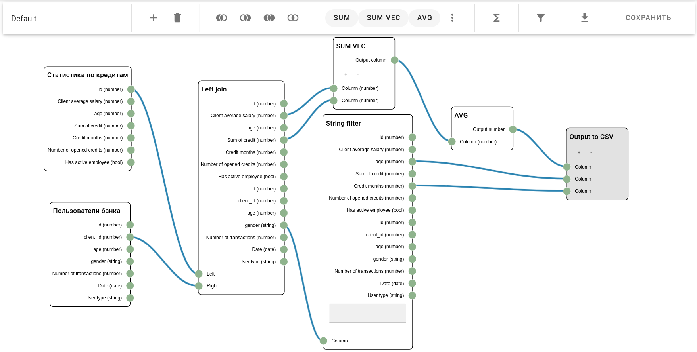

# MORETech_3_Foxhound_team
Хакатон от ВТБ more.tech3.0, 8-10 октября 2021 г



## Описание приложения
Данное решение представляет собой сервис для создания фич из различных датасетов. 

Приложение позволяет выбирать датасеты из списка, применять к ним различные операции и отправлять результат в виде JSON
 алгоритму.

## Инструкция по запуску
Демо решение расположено по адресу [http://178.154.222.147/](http://178.154.222.147/)

Для запуска локально, см. Развертывание через docker-compose

## Руководство пользователя
В интерфейсе присутствует три основных вкладки: Датасеты, Редактор и Профиль. В профиле отображаются личные данные пользователя.

Во вкладке Датасеты представлен список доступных датасетов. Их можно выбирать нажимая на галочку, и далее переместиться в Редактор.

Вкладка Редактор содержит редактор фичей, основанный на графах. Здесь можно применять различные операции к датасетам и выводить информацию
в определенные форматы.

## Развертывание через docker-compose
1. Установить [docker](https://docs.docker.com/engine/install/ubuntu/)
2. Установить [docker-compose](https://docs.docker.com/compose/install/)
3. В папке compose создать файлы .env и .uwsgi.env и заполнить их в соответствии с примерами
4. Запустить файл build.sh с правами суперпользователя
```bash
sudo ./build.sh
```
5. Настроить внешний nginx, который будет пересылать все запросы на порт приложения
## Команды docker-compose 
Все команды необходимо выполнять в папке compose
- Остановить все контейнеры
```bash
sudo docker-compose stop
```
- Перезапустить контейнер
```bash
sudo docker-compose restart {container_name}
```
- Запуск manage.py shell
```bash
sudo docker-compose exec web python manage.py shell
```
